# ChapteriZen — Seudocódigo

---

## 1. Seudocódigo clásico (estilo algoritmo)

```
ALGORITMO GenerarChapters(video, parametros)

  // ── FASE 0: arranque en la ventana principal ──────────────────────
  SI video no existe O extensión no es de video ENTONCES
    MOSTRAR error "Selecciona un video válido"
    TERMINAR
  FIN SI

  construir params desde los campos de la GUI (carpeta_salida, usar_exacto,
    crear_subcarpeta, search_override, submuestreo, porcion_theme, puntuacion_minima)

  INICIAR ResolverWorker(video, params) EN HILO SEPARADO   // ver FASE 1
  // la ventana principal queda escuchando señales: log, progress,
  // need_pick, resolved, failed


  // ══════════════════════════════════════════════════════════════════
  // FASE 1: ResolverWorker — resolver título, temporada, episodio y slug
  // ══════════════════════════════════════════════════════════════════
  FUNCION ResolverWorker.run()

    (temporada, episodio) ← ExtraerDeNombreArchivo(video)
    temporada_fue_default ← (temporada no estaba en el nombre; se asume 1)

    SI hay search_override (texto manual desde la GUI) ENTONCES
      consulta_base ← override
    SINO
      consulta_base ← InferirTituloDesdeNombreArchivo(video)
      via_trace_moe ← FALSO

      // ── Identificación cuando el nombre de archivo no sirve ──────
      SI titulo NO es reconocible (ruido técnico, o solo dígitos) ENTONCES
        MOSTRAR "identificando con trace.moe…"
        detectado ← IdentificarPorFotogramas(video)      // ver FASE 1a
        consulta_base ← detectado.titulo
        via_trace_moe ← VERDADERO
        SI detectado.similitud >= 0.95 Y detectado.anilist_id existe ENTONCES
          anilist_confirmado ← VERDADERO   // salta la búsqueda por nombre en Jikan
        FIN SI
      FIN SI

      picked_base ← NULO
      titulo_confiable ← FALSO

      SI anilist_confirmado ENTONCES
        MOSTRAR "Título confirmado por AniList" (sin buscar en Jikan)
      SINO
        // ── Resolución de título con fallback Jikan → AniList ──────
        INTENTAR
          (titulo_resuelto, picked_base, titulo_confiable, ts1) ←
            Jikan.ResolverTitulo(consulta_base)
        CAPTURAR error DE Jikan
          SI error es transitorio (503/504/timeout, reintentos agotados) ENTONCES
            MOSTRAR "Jikan no disponible, usando AniList como respaldo…"
            (titulo_resuelto, picked_base, titulo_confiable, ts1) ←
              AniList.BuscarTitulo(consulta_base)
          SINO
            RELANZAR error   // error no transitorio: no hay respaldo
          FIN SI
        FIN INTENTAR

        // ── Cross-verificación (dos caminos mutuamente excluyentes) ─
        SI NO titulo_confiable Y NO via_trace_moe Y ts1 >= 0.85 Y picked_base existe ENTONCES
          detectado_xv ← IdentificarPorFotogramas(video)     // nueva llamada
          titulo_anilist ← AniList.TituloPorID(detectado_xv.anilist_id)
          SI titulo_anilist existe ENTONCES
            (titulo_resuelto, picked_base, titulo_confiable) ←
              VerificarYResolverDiscrepancia(titulo_resuelto, titulo_anilist)   // puede abrir PICKER
          FIN SI
        SINO SI NO titulo_confiable Y via_trace_moe Y picked_base existe
             Y el anilist_id ya detectado antes existe ENTONCES
          // reutiliza el anilist_id ya obtenido — no vuelve a llamar trace.moe
          titulo_anilist ← AniList.TituloPorID(anilist_id_ya_detectado)
          SI titulo_anilist existe ENTONCES
            (titulo_resuelto, picked_base, titulo_confiable) ←
              VerificarYResolverDiscrepancia(titulo_resuelto, titulo_anilist)   // puede abrir PICKER
          FIN SI
        FIN SI

        // ── Resolución de temporada (dos caminos mutuamente excluyentes) ─
        SI temporada >= 2 Y picked_base existe Y temporada NO era default ENTONCES
          // Camino A: el nombre de archivo declaró la temporada explícitamente
          FUENTE ← "Jikan" SI picked_base tiene 'mal_id' SINO "AniList"
          picked_temporada ← FUENTE.NavegarCadenaDeSecuelas(picked_base, temporada)
          canon ← TituloPrincipal(picked_temporada)   // siempre romaji/principal
          SI canon preserva los tokens del nombre de archivo ENTONCES
            consulta_base ← canon
          SINO SI alguna variante oficial del título (inglés/nativo/preferido)
                  SÍ preserva esos tokens ENTONCES
            consulta_base ← canon   // se adopta el romaji, NUNCA la variante que aceptó
            MOSTRAR "coincide por variante {idioma} → adoptando romaji"
          SINO
            MOSTRAR "⚠ Ignorando canon de temporada por recorte" (se mantiene consulta_base)
          FIN SI
        SINO SI temporada era default Y picked_base existe Y episodio > 0 ENTONCES
          // Camino B: sin temporada explícita, detectar por conteo de episodios
          SI episodio > episodios_de_temporada_1 ENTONCES
            FUENTE ← "Jikan" SI picked_base tiene 'mal_id' SINO "AniList"
            (picked_base, episodio, temporada) ← FUENTE.NavegarPorEpisodio(picked_base, episodio)
          FIN SI
          AplicarCanonSiPreservaTokens(consulta_base, picked_base)   // mismo gate multi-variante
        SINO
          AplicarCanonSiPreservaTokens(consulta_base, picked_base)
        FIN SI
      FIN SI
    FIN SI

    SI NO usar_exacto ENTONCES
      EMITIR resolved(slug="", titulo_usado=consulta_base, episodio)
      TERMINAR   // modo heurístico puro, no hace falta AnimeThemes
    FIN SI

    // ── Resolución del slug en AnimeThemes ──────────────────────────
    (slug, titulo_usado) ← ResolverSlugConPicker(consulta_base, temporada, picked_base)
    EMITIR resolved(slug, titulo_usado, episodio)

  FIN FUNCION


  FUNCION ResolverSlugConPicker(consulta, temporada, item_fuente)
    consultas ← [consulta] + TitulosAlternativosDe(item_fuente)   // Jikan o AniList según shape

    PARA CADA q EN consultas HACER
      resultados ← AnimeThemes.Buscar(q)
      resultados ← FiltrarPorTokenObligatorio(resultados) Y PreferirPorTemporada(resultados)
      SI hay exactamente 1 resultado O hay un match exacto de título ENTONCES
        DEVOLVER (slug, nombre)
      FIN SI
    FIN PARA

    SI ninguna consulta dio resultado ÚTIL en absoluto ENTONCES
      DEVOLVER ResolverViaJikanConPicker(consulta)   // último respaldo
    FIN SI

    elegido ← PICKER(resultados ambiguos de AnimeThemes)
    DEVOLVER (elegido.slug, elegido.nombre)
  FIN FUNCION


  FUNCION ResolverViaJikanConPicker(consulta)
    resultados ← Jikan.BuscarAnime(consulta)
    SI no hay resultados ENTONCES LANZAR error FIN SI
    elegido ← resultados[0] SI hay solo 1 SINO PICKER(resultados de Jikan)
    PARA CADA titulo_alt EN TitulosDe(elegido) HACER
      resultados_at ← AnimeThemes.Buscar(titulo_alt)
      SI hay exactamente 1 ENTONCES DEVOLVER (slug, nombre) FIN SI
      SI hay varios ENTONCES
        elegido_at ← PICKER(resultados_at)
        DEVOLVER (elegido_at.slug, elegido_at.nombre)
      FIN SI
    FIN PARA
    LANZAR error "No encontré la serie en AnimeThemes"
  FIN FUNCION


  // (FASE 1a) IdentificarPorFotogramas: extrae 9 fotogramas del video
  // (distribuidos uniformemente, del centro hacia los extremos), los
  // envía a trace.moe en lotes crecientes, y por consenso de mayoría
  // (por anilist_id, y luego por número de episodio) determina el
  // anime y episodio más probable, con su similitud.


  // ══════════════════════════════════════════════════════════════════
  // Ventana principal: recibe las señales de ResolverWorker
  // ══════════════════════════════════════════════════════════════════
  AL RECIBIR need_pick(opciones):
    idx ← MOSTRAR diálogo modal de selección (o NULO si el usuario cancela)
    ResolverWorker.entregar_pick(idx)

  AL RECIBIR resolved(params):
    REGISTRAR título/episodio/slug en el log
    INICIAR ChapterizerWorker(params) EN HILO SEPARADO   // ver FASE 2

  AL RECIBIR failed(mensaje):
    MOSTRAR error, REHABILITAR controles


  // ══════════════════════════════════════════════════════════════════
  // FASE 2: ChapterizerWorker — generar el XML de capítulos
  // ══════════════════════════════════════════════════════════════════
  FUNCION ChapterizerWorker.run()

    ASEGURAR que ffmpeg/ffprobe existen
    duracion ← DuracionDelVideo(video)
    ruta_salida ← ConstruirRutaDeSalida(video, params)

    SI NO usar_exacto ENTONCES
      chapters ← ChaptersHeuristicos(duracion)   // Intro / Opening~60s / Ending~dur-95s
      GuardarChaptersXML(ruta_salida, chapters)
      EMITIR terminado(ruta_salida)
      TERMINAR
    FIN SI

    SI slug está vacío ENTONCES LANZAR error FIN SI

    anime_json ← AnimeThemes.ObtenerAnime(slug)
    mapa_titulos ← TitulosMostrablesDeTemas(anime_json)
    DESCARGAR Y CACHEAR audios OP/ED de AnimeThemes (solo los que cubren este episodio)
    CARGAR todos los WAV de temas en memoria, resamplear si hace falta,
      PRECALCULAR features (MFCC + chroma) de cada uno

    SI no se cargó ningún tema ENTONCES LANZAR error FIN SI

    zona_op ← [0, min(300s, 60% de la duración)]
    zona_ed ← [max(0, duración - 300s), duración]

    mejor_op ← BuscarConVentanaDeslizante(zona_op, temas_OP)
    mejor_ed ← BuscarConVentanaDeslizante(zona_ed, temas_ED)

    // ── Fallback de cobertura: si falta un rol completo en AnimeThemes ──
    SI mejor_ed es NULO Y hay temas OP pero NO hay temas ED ENTONCES
      mejor_ed ← BuscarConVentanaDeslizante(zona_ed, temas_OP)   // probar OP en la zona final
    FIN SI
    SI mejor_op es NULO Y hay temas ED pero NO hay temas OP ENTONCES
      mejor_op ← BuscarConVentanaDeslizante(zona_op, temas_ED)   // probar ED en la zona inicial
    FIN SI

    SI mejor_op es NULO Y mejor_ed es NULO ENTONCES
      chapters ← ChaptersHeuristicos(duracion)   // no se encontró nada, modo heurístico
    SINO
      chapters ← ConstruirChaptersDesdeMarcasDeTiempo(mejor_op, mejor_ed, duracion)
      // ubica Introducción/Opening/Episodio/Ending/Conclusión según
      // si las marcas caen cerca del inicio/final del video, o si
      // solo hay ED (patrón "recap sin opening")
    FIN SI

    GuardarChaptersXML(ruta_salida, chapters)
    EMITIR terminado(ruta_salida)

  FIN FUNCION


  FUNCION BuscarConVentanaDeslizante(zona, temas_candidatos)
    mejor ← NULO
    PARA CADA ventana DE 90s (paso 15s) DENTRO DE zona HACER
      candidatos_fft ← []
      PARA CADA tema EN temas_candidatos HACER
        score ← CorrelacionFFT(ventana, tema)
        SI score existe ENTONCES AGREGAR (tema, score) A candidatos_fft FIN SI
      FIN PARA
      SI candidatos_fft está vacío ENTONCES CONTINUAR FIN SI

      top3 ← los 3 candidatos_fft con mayor score
      SI el mejor score de top3 < umbral dinámico (basado en dispersión) ENTONCES
        CONTINUAR   // pruning temprano, no vale la pena correr DTW
      FIN SI

      PARA CADA candidato EN top3 HACER
        score_dtw ← DTW(ventana, candidato)
        score_final ← 0.70 * score_dtw + 0.30 * score_fft
        SI score_final >= puntuacion_minima Y score_final > mejor.puntuacion ENTONCES
          mejor ← (candidato.tema, ventana.inicio, ventana.fin, score_final)
        FIN SI
      FIN PARA
    FIN PARA
    DEVOLVER mejor
  FIN FUNCION


  // ══════════════════════════════════════════════════════════════════
  // Ventana principal: recibe las señales de ChapterizerWorker
  // ══════════════════════════════════════════════════════════════════
  AL RECIBIR terminado(ruta_salida):
    MOSTRAR "Chapters generados: {ruta_salida}", REHABILITAR controles

  AL RECIBIR fallo(mensaje):
    MOSTRAR error, REHABILITAR controles

FIN ALGORITMO
```

---

## 2. Lenguaje natural paso a paso

**1. El usuario elige un video** en la ventana principal, opcionalmente una carpeta de salida, y decide si quiere coincidencia exacta de OP/ED (activado por defecto) o solo capítulos aproximados. Al presionar "Generar XML", el programa arranca un primer proceso en segundo plano encargado de **averiguar qué anime y episodio es** (`ResolverWorker`).

**2. Primero se intenta leer el nombre del archivo.** El programa extrae temporada y episodio del nombre (si están, por ejemplo "S02E05"), y limpia el título de tags de release (resolución, codec, grupo de fansub, etc.).

**3. Si el nombre del archivo no sirve** para identificar el anime (por ejemplo, si es solo un hash o números), **el programa mira el video en sí**: extrae varios fotogramas distribuidos a lo largo del episodio y los envía a trace.moe, un servicio que reconoce escenas de anime por imagen. Si varios fotogramas coinciden en el mismo anime con alta confianza, se da por identificado — y si la confianza es muy alta (95% o más), este resultado ya es suficiente y ni siquiera hace falta seguir buscando el nombre en Jikan.

**4. En el caso normal, el título se busca en Jikan** (la base de datos de MyAnimeList) para confirmarlo y obtener metadatos (episodios totales, ID, etc.). **Si Jikan está caído** (no responde después de varios reintentos), el programa **usa AniList como respaldo automático** — el mismo resultado se puede obtener de cualquiera de las dos fuentes, y el resto del programa no necesita saber cuál fue.

**5. Si Jikan encontró varios animes parecidos** (no está seguro de cuál es), el programa hace una verificación cruzada: identifica el anime también por fotogramas (o reutiliza la identificación de fotogramas si ya se había hecho antes) y compara ambos resultados. Si coinciden, el título queda confirmado. **Si no coinciden, se le pregunta al usuario** cuál de los dos es el correcto, mostrando ambas opciones en una ventana de selección.

**6. Si el nombre de archivo indicaba una temporada específica** (por ejemplo, temporada 2), el programa navega la cadena de secuelas de la serie (temporada 1 → temporada 2 → …) hasta encontrar la entrada correcta, y adopta ese título "canónico". Antes de aceptarlo, verifica que ese título no descarte palabras importantes del nombre original del archivo — y si el nombre de archivo estaba en un idioma distinto al título oficial (por ejemplo, "Chained Soldier" para una serie cuyo título oficial es "Mato Seihei no Slave 2"), el programa reconoce que son la misma serie comparando también contra las variantes de idioma conocidas, pero siempre termina adoptando el título en su forma original (romaji), porque es el que usa AnimeThemes para buscar las canciones más adelante.

**7. Si el archivo no indicaba temporada pero el número de episodio es más alto** de lo que tiene la primera temporada, el programa detecta automáticamente que en realidad pertenece a una temporada posterior y recalcula el episodio relativo.

**8. Si no se pidió coincidencia exacta**, el proceso de identificación termina acá — el título encontrado se usa directamente y se pasa a la generación de capítulos en modo aproximado.

**9. Si se pidió coincidencia exacta, el programa busca la serie en AnimeThemes** (el catálogo de openings/endings de anime) usando el título y, si hace falta, títulos alternativos conocidos. Si hay más de un resultado posible y ninguno es exacto, **se le pide al usuario que elija** de una lista. Si AnimeThemes no encuentra nada en absoluto, como último recurso el programa busca directamente en Jikan y reintenta con cada título alternativo que encuentre ahí.

**10. Una vez identificado el slug de AnimeThemes**, arranca el segundo proceso (`ChapterizerWorker`), que descarga y guarda en caché los audios de los openings/endings de esa serie.

**11. El programa compara el audio del episodio contra cada tema descargado**, usando una ventana deslizante que recorre el inicio (buscando el opening) y el final (buscando el ending) del video. Para cada posición, primero hace una comparación rápida por FFT (correlación de frecuencias) para descartar los temas que claramente no coinciden, y luego, solo con los mejores candidatos, hace una comparación más precisa y costosa (DTW, que tolera pequeños desfases de tiempo). El resultado combina ambos puntajes.

**12. Si AnimeThemes no tenía catalogado un ending pero sí un opening** (o viceversa), el programa intenta igual encontrar el tema disponible en la zona opuesta del video, por si acaso se usó ahí.

**13. Si se encontró al menos un match de audio**, el programa arma los capítulos ubicando el inicio/fin exacto del opening y/o ending sobre la línea de tiempo del episodio. **Si no se encontró ningún match**, cae al mismo modo heurístico que se usa cuando no se pidió coincidencia exacta: capítulos aproximados de Introducción / Opening / Ending / Conclusión basados en proporciones típicas de duración.

**14. Finalmente, se guarda el XML de capítulos** (compatible con mkvmerge) junto al video o en la carpeta elegida, y se muestra un mensaje de éxito. Si en cualquier punto del proceso ocurre un error irrecuperable, se muestra el mensaje de error correspondiente y los controles de la ventana vuelven a habilitarse para intentar con otro video.

---

## 3. Diagrama de flujo en texto

```mermaid
flowchart TD
    A(["Usuario elige video y presiona 'Generar XML'"]) --> B{"¿Título usable en el nombre de archivo?"}
    B -->|Sí| F["Buscar título en Jikan"]
    B -->|No| C["Identificar por fotogramas (trace.moe)"]
    C --> D{"¿Similitud ≥ 95% y hay ID de AniList disponible?"}
    D -->|Sí| E["Título confirmado por AniList (se salta Jikan y la resolución de temporada)"]
    D -->|No| F

    F --> G{"¿Jikan caído? (503/504, reintentos agotados)"}
    G -->|Sí| H["Fallback: buscar título en AniList"]
    G -->|No| I{"¿Título confiable?"}
    H --> I

    I -->|Sí| N{"¿Temporada explícita en el archivo, con resultado base disponible? (Camino A)"}
    I -->|No| J{"¿La identificación original vino de trace.moe?"}

    J -->|No, vino del nombre de archivo| K{"¿ts1 ≥ 0.85 y hay resultado de Jikan?"}
    K -->|Sí| K1["Verificar con trace.moe (nueva identificación por fotogramas)"]
    K -->|No| N
    K1 --> K2["Obtener título de AniList por el ID detectado"]
    K2 --> L{"¿Coincide con el título de Jikan?"}

    J -->|Sí, ya vino de trace.moe| M{"¿Hay anilist_id ya detectado y resultado de Jikan?"}
    M -->|Sí| M1["Reutilizar anilist_id: obtener título de AniList por ID"]
    M -->|No| N
    M1 --> L

    L -->|Sí| N
    L -->|No| P["🖱️ PICKER: discrepancia Jikan vs AniList/trace.moe"]
    P --> N

    N -->|Sí, Camino A| Q["Navegar cadena de secuelas (Jikan o AniList) hasta la temporada indicada"]
    Q --> Q1{"¿El canon preserva los tokens del archivo, directo o vía variante oficial?"}
    Q1 -->|Sí| T{"¿Se pidió coincidencia exacta (OP/ED)?"}
    Q1 -->|No| Q2["⚠️ Ignorar canon de temporada por recorte (se mantiene el título actual)"]
    Q2 --> T

    N -->|No| N2{"¿Temporada por defecto, con resultado base y episodio > 0? (Camino B)"}
    N2 -->|Sí, Camino B| R{"¿Episodio supera el conteo de episodios de temporada 1?"}
    R -->|Sí| S["Navegar secuelas por conteo de episodios"]
    R -->|No| GB["Aplicar canon si preserva tokens (directo o vía variante oficial)"]
    S --> GB
    GB --> T

    N2 -->|No, ninguno de los dos caminos| GC["Aplicar canon si preserva tokens (directo o vía variante oficial)"]
    GC --> T

    E --> T

    T -->|No| U["Fin de ResolverWorker, sin slug"]
    T -->|Sí| V["Buscar slug en AnimeThemes"]
    V --> W{"¿Resultado ambiguo o no encontrado?"}
    W -->|Sí| X["🖱️ PICKER: AnimeThemes (o respaldo vía Jikan + 🖱️ PICKER: Jikan)"]
    W -->|No| Y["Iniciar ChapterizerWorker"]
    X --> Y
    U --> Y

    Y --> Z{"¿Se pidió coincidencia exacta?"}
    Z -->|No| AA["Chapters heurísticos (Intro/Opening/Ending por proporción)"]
    Z -->|Sí| AB["Descargar y cachear audio OP/ED de AnimeThemes"]
    AB --> AC["Buscar OP en zona inicial (FFT top-3, luego DTW)"]
    AB --> AD["Buscar ED en zona final (FFT top-3, luego DTW)"]

    AC --> AE{"¿No hay match de ED, y AnimeThemes no cataloga ED pero sí OP?"}
    AD --> AE
    AE -->|Sí| AF["Reintentar: buscar tema OP en la zona final"]
    AE -->|No| AG{"¿No hay match de OP, y AnimeThemes no cataloga OP pero sí ED?"}
    AF --> AG
    AG -->|Sí| AH["Reintentar: buscar tema ED en la zona inicial"]
    AG -->|No| AI{"¿Se encontró match de OP y/o ED?"}
    AH --> AI

    AI -->|No| AJ["Chapters heurísticos (respaldo)"]
    AI -->|Sí| AK["Chapters exactos desde las marcas de tiempo del match"]

    AA --> AL["Guardar XML de capítulos"]
    AJ --> AL
    AK --> AL
    AL --> AM(["Mostrar éxito al usuario"])
```



(En cualquier punto del proceso, un error irrecuperable corta el flujo y muestra un mensaje de error en vez de continuar — no representado en el diagrama para no saturarlo.)
