# ChapteriZen — Seudocódigo

---

## 1. Seudocódigo clásico (estilo algoritmo)

```
ALGORITMO GenerarChapters(video, parametros)

  // ── FASE 0: arranque en la ventana principal ──────────────────────
  SI video no existe O extensión no es de video ENTONCES
    MOSTRAR error "Selecciona un video válido"
    TERMINAR
  FIN SI

  construir params desde los campos de la GUI (carpeta_salida,
    crear_subcarpeta, search_override)
  // submuestreo, porcion_theme y puntuacion_minima ya NO son campos de
  // la GUI -- quedan fijos en ParametrosTrabajo con los mismos valores
  // por defecto que ya se validaban internamente. No hay ningún modo
  // "aproximado": el matching exacto contra AnimeThemes es el único
  // comportamiento -- cualquier fallo termina sin XML, nunca en
  // capítulos heurísticos.

  INICIAR ResolverWorker(video, params) EN HILO SEPARADO   // ver FASE 1
  // la ventana principal queda escuchando señales: log, progress,
  // need_pick, resolved, failed, cancelado


  // ══════════════════════════════════════════════════════════════════
  // FASE 1: ResolverWorker — resolver título, temporada, episodio y slug
  // ══════════════════════════════════════════════════════════════════
  FUNCION ResolverWorker.run()

    (temporada, episodio) ← ExtraerDeNombreArchivo(video)
    temporada_fue_default ← (temporada no estaba en el nombre; se asume 1)

    SI hay search_override (texto manual desde la GUI) ENTONCES
      consulta_base ← override
    SINO
      consulta_base ← InferirTituloDesdeNombreArchivo(video)
      via_trace_moe ← FALSO
      anilist_confirmado ← FALSO

      // ── Identificación cuando el nombre de archivo no sirve ──────
      SI título no es reconocible (ruido técnico, solo dígitos, o
         artefacto de release pegado al título) ENTONCES
        MOSTRAR "identificando con trace.moe…"
        detectado ← IdentificarPorFotogramas(video)      // ver FASE 1a
        consulta_base ← detectado.titulo
        via_trace_moe ← VERDADERO
        SI detectado.anilist_id existe Y detectado.similitud >= _TRACE_UMBRAL_RAPIDO (0.95) ENTONCES
          anilist_confirmado ← VERDADERO   // salta la búsqueda por nombre en Jikan/AniList
        FIN SI
      FIN SI

      picked_base ← NULO
      titulo_confiable ← FALSO

      SI anilist_confirmado ENTONCES
        MOSTRAR "Título confirmado por AniList" (sin buscar en Jikan ni AniList por nombre)
        // Limitación conocida: picked_base queda NULO en este camino, así
        // que la resolución de temporada por secuela (más abajo) no corre.
      SINO
        // ── Resolución de título: Jikan primero, con DOS gatillos de
        //    respaldo a AniList (mutuamente excluyentes, no ambos) ────
        INTENTAR
          (titulo_resuelto, picked_base, titulo_confiable, ts1) ←
            Jikan.ResolverTitulo(consulta_base)
        CAPTURAR error DE Jikan
          // Gatillo 1: Jikan no respondió (excepción transitoria — 503/504/
          // timeout, reintentos agotados por tenacity).
          SI error es transitorio ENTONCES
            MOSTRAR "Jikan no disponible, usando AniList como respaldo…"
            (titulo_resuelto, picked_base, titulo_confiable, ts1) ←
              AniList.BuscarTitulo(consulta_base)
          SINO
            RELANZAR error   // error no transitorio: no hay respaldo
          FIN SI
        SIN ERROR (Jikan respondió)
          // Gatillo 2: Jikan respondió 200 pero genuinamente no encontró
          // nada (picked_base es NULO sin que se haya lanzado excepción).
          // Misma consulta, sin ningún ajuste -- no hay señal sobre POR
          // QUÉ Jikan no encontró nada que justifique cambiarla antes de
          // probar AniList.
          SI picked_base es NULO ENTONCES
            MOSTRAR "Jikan no encontró resultados, probando AniList…"
            (titulo_resuelto, picked_base, titulo_confiable, ts1) ←
              AniList.BuscarTitulo(consulta_base)
          FIN SI
        FIN INTENTAR

        // ── Cross-verificación (dos caminos mutuamente excluyentes,
        //    ninguno se unifica con el otro porque su forma de obtener
        //    datos es distinta) ──────────────────────────────────────
        SI NO titulo_confiable Y NO via_trace_moe Y ts1 >= 0.85 Y picked_base existe ENTONCES
          // Camino de verificación directa: Jikan quedó ambiguo, el
          // filename sí tenía título reconocible -- se llama trace.moe
          // por primera vez para esta corrida.
          detectado_xv ← IdentificarPorFotogramas(video)     // nueva llamada
          titulo_anilist ← AniList.TituloPorID(detectado_xv.anilist_id)
          SI titulo_anilist existe ENTONCES
            (titulo_resuelto, picked_base, titulo_confiable) ←
              VerificarYResolverDiscrepancia(titulo_resuelto, titulo_anilist)   // puede abrir PICKER
          FIN SI
        SINO SI NO titulo_confiable Y via_trace_moe Y picked_base existe
             Y el anilist_id ya detectado antes existe ENTONCES
          // Camino de ID reutilizado: la identificación original YA vino
          // de trace.moe (confianza media, por debajo de 0.95) y Jikan
          // después quedó ambiguo -- reutiliza el anilist_id ya obtenido
          // en vez de llamar trace.moe una segunda vez.
          titulo_anilist ← AniList.TituloPorID(anilist_id_ya_detectado)
          SI titulo_anilist existe ENTONCES
            (titulo_resuelto, picked_base, titulo_confiable) ←
              VerificarYResolverDiscrepancia(titulo_resuelto, titulo_anilist)   // puede abrir PICKER
          FIN SI
        FIN SI

        // ── Resolución de temporada (dos caminos mutuamente excluyentes) ─
        SI temporada >= 2 Y picked_base existe Y temporada NO era default ENTONCES
          // Camino A: el nombre de archivo declaró la temporada explícitamente
          FUENTE ← "Jikan" SI picked_base tiene 'mal_id' SINO "AniList"
          picked_temporada ← FUENTE.NavegarCadenaDeSecuelas(picked_base, temporada)
          canon ← TituloPrincipal(picked_temporada)   // siempre romaji/principal
          consulta_base_antes ← consulta_base
          consulta_base ← AplicarCanonMultivariante(consulta_base, picked_temporada, canon,
                                                      titulo_confiable=VERDADERO)
          // ¿El canon fue aceptado (directo o vía variante oficial
          // inglés/nativo/preferido) o rechazado por recorte de tokens?
          // AplicarCanonMultivariante no devuelve ese booleano -- se
          // infiere comparando consulta_base antes/después de llamarla.
          SI consulta_base ≠ consulta_base_antes ENTONCES
            // Canon ACEPTADO → picked_base pasa a ser la temporada resuelta.
            picked_base ← picked_temporada
          // SI el canon fue RECHAZADO, picked_base NO se reasigna --
          // sigue siendo la temporada base (temporada 1). Reasignarlo
          // igual reutilizaría, para el atajo de AnimeThemes por ID más
          // abajo, la misma entidad que este mismo bloque acaba de
          // descartar por no relacionarse con el archivo.
          FIN SI
        SINO SI temporada_fue_default Y picked_base existe Y episodio > 0 ENTONCES
          // Camino B: sin temporada explícita, detectar por conteo de episodios
          SI episodio > episodios_de_temporada_1 ENTONCES
            FUENTE ← "Jikan" SI picked_base tiene 'mal_id' SINO "AniList"
            (picked_base, episodio, temporada) ← FUENTE.NavegarPorEpisodio(picked_base, episodio)
            // Acá SÍ se reasigna picked_base incondicionalmente -- a
            // diferencia de Camino A, no hay un canon que pueda
            // rechazarse: NavegarPorEpisodio ya devuelve la entidad
            // correcta directamente.
          FIN SI
          AplicarCanonSiPreservaTokens(consulta_base, picked_base)   // mismo gate multi-variante
        SINO
          AplicarCanonSiPreservaTokens(consulta_base, picked_base)
        FIN SI
      FIN SI
    FIN SI

    // Ya no hay ninguna salida temprana por "modo aproximado" acá --
    // la resolución de slug corre siempre.

    // ── Resolución del slug en AnimeThemes ──────────────────────────
    ids_externos      ← IdsExternosDe(picked_base)          // [] si hay override
    titulos_conocidos ← TitulosConocidosDe(picked_base)      // incluye título japonés/native
    (slug, titulo_usado) ← ResolverSlugConPicker(consulta_base, temporada,
                                                   jikan_item=picked_base,
                                                   ids_externos, titulos_conocidos)
    EMITIR resolved(slug, titulo_usado, episodio)

  FIN FUNCION


  FUNCION ResolverSlugConPicker(consulta, temporada, item_fuente, ids_externos, titulos_conocidos)

    // ── Camino del atajo por ID (se intenta PRIMERO, si hay candidatos) ──
    PARA CADA (sitio, id_externo) EN ids_externos HACER
      resultados_id ← AnimeThemes.BuscarPorRecursoExterno(sitio, id_externo)
      // filter[has]=resources es obligatorio en esta consulta -- sin él,
      // AnimeThemes ignora el filtro de sitio/ID en silencio y devuelve
      // la lista completa sin filtrar (confirmado en vivo, no asumido).
      SI len(resultados_id) ≠ 1 ENTONCES CONTINUAR (probar el siguiente ID) FIN SI
      nombre_at ← resultados_id[0].nombre
      slug_at   ← resultados_id[0].slug
      SI slug_at existe Y TokenOkContraTitulosConocidos(nombre_at, titulos_conocidos) ENTONCES
        DEVOLVER (slug_at, nombre_at)   // sin picker, sin búsqueda de texto
      FIN SI
      // si no pasa la validación, NO se abre picker acá -- simplemente
      // se prueba el siguiente ID candidato (o se cae al camino de texto
      // si no queda ninguno)
    FIN PARA

    // ── Camino de texto (respaldo, o si no hay ids_externos) ────────
    // Sin cambios respecto al diseño anterior a esta sesión.
    consultas ← [consulta] + TitulosAlternativosDe(item_fuente)   // Jikan o AniList según shape

    PARA CADA q EN consultas HACER
      resultados ← AnimeThemes.Buscar(q)
      resultados ← FiltrarPorTokenObligatorio(resultados) Y PreferirPorTemporada(resultados)
      SI hay exactamente 1 resultado O hay un match exacto de título ENTONCES
        DEVOLVER (slug, nombre)
      FIN SI
    FIN PARA

    SI ninguna consulta dio resultado ÚTIL en absoluto ENTONCES
      DEVOLVER ResolverViaJikanConPicker(consulta)   // último respaldo
    FIN SI

    elegido ← PICKER(resultados ambiguos de AnimeThemes)
    // cada fila del picker puede mostrar, debajo del nombre principal,
    // el synonym en inglés de AnimeThemes si existe, o si no el
    // type="Other" más largo disponible -- ningún efecto sobre la
    // lógica de decisión, solo ayuda visual para elegir
    DEVOLVER (elegido.slug, elegido.nombre)
  FIN FUNCION


  FUNCION ResolverViaJikanConPicker(consulta)
    resultados ← Jikan.BuscarAnime(consulta)
    SI no hay resultados ENTONCES LANZAR error FIN SI
    elegido ← resultados[0] SI hay solo 1 SINO PICKER(resultados de Jikan)
    PARA CADA titulo_alt EN TitulosDe(elegido) HACER
      resultados_at ← AnimeThemes.Buscar(titulo_alt)
      SI hay exactamente 1 ENTONCES DEVOLVER (slug, nombre) FIN SI
      SI hay varios ENTONCES
        elegido_at ← PICKER(resultados_at)
        DEVOLVER (elegido_at.slug, elegido_at.nombre)
      FIN SI
    FIN PARA
    LANZAR error "No encontré la serie en AnimeThemes"
  FIN FUNCION


  // (FASE 1a) IdentificarPorFotogramas: extrae 9 fotogramas del video
  // (distribuidos uniformemente, del centro hacia los extremos), los
  // envía a trace.moe en lotes crecientes, y por consenso de mayoría
  // (por anilist_id, y luego por número de episodio) determina el
  // anime y episodio más probable, con su similitud.


  // ══════════════════════════════════════════════════════════════════
  // Ventana principal: recibe las señales de ResolverWorker
  // ══════════════════════════════════════════════════════════════════
  AL RECIBIR need_pick(opciones):
    idx ← MOSTRAR diálogo modal de selección (o NULO si el usuario cancela)
    ResolverWorker.entregar_pick(idx)

  AL RECIBIR resolved(params):
    REGISTRAR título/episodio/slug en el log
    INICIAR ChapterizerWorker(params) EN HILO SEPARADO   // ver FASE 2

  AL RECIBIR failed(mensaje):
    MOSTRAR error (QMessageBox.warning), REHABILITAR controles

  AL RECIBIR cancelado():
    // el usuario cerró un picker sin elegir -- no es un error, no se
    // muestra ninguna ventana emergente
    REHABILITAR controles


  // ══════════════════════════════════════════════════════════════════
  // FASE 2: ChapterizerWorker — generar el XML de capítulos
  // ══════════════════════════════════════════════════════════════════
  FUNCION ChapterizerWorker.run()

    ASEGURAR que ffmpeg/ffprobe existen
    duracion ← DuracionDelVideo(video)
    ruta_salida ← ConstruirRutaDeSalida(video, params)

    SI slug está vacío ENTONCES
      LANZAR error "Slug vacío. La serie no fue resuelta en el hilo principal."
    FIN SI

    anime_json ← AnimeThemes.ObtenerAnime(slug)
    mapa_titulos ← TitulosMostrablesDeTemas(anime_json)
    DESCARGAR Y CACHEAR audios OP/ED de AnimeThemes (solo los que cubren este episodio)
    CARGAR todos los WAV de temas en memoria, resamplear si hace falta,
      PRECALCULAR features (MFCC + chroma) de cada uno

    SI no se cargó ningún tema ENTONCES
      LANZAR error "AnimeThemes no tiene ningún OP/ED catalogado para esta serie."
    FIN SI

    zona_op ← [0, min(300s, 60% de la duración)]
    zona_ed ← [max(0, duración - 300s), duración]

    mejor_op ← BuscarConVentanaDeslizante(zona_op, temas_OP)
    mejor_ed ← BuscarConVentanaDeslizante(zona_ed, temas_ED)

    // ── Fallback de cobertura: si falta un rol completo en AnimeThemes ──
    SI mejor_ed es NULO Y hay temas OP pero NO hay temas ED ENTONCES
      mejor_ed ← BuscarConVentanaDeslizante(zona_ed, temas_OP)   // probar OP en la zona final
    FIN SI
    SI mejor_op es NULO Y hay temas ED pero NO hay temas OP ENTONCES
      mejor_op ← BuscarConVentanaDeslizante(zona_op, temas_ED)   // probar ED en la zona inicial
    FIN SI

    SI mejor_op es NULO Y mejor_ed es NULO ENTONCES
      // Ya NO hay modo heurístico de respaldo -- un fallo de matching es
      // un fallo real. No se genera ningún XML.
      LANZAR error "No se encontró coincidencia de audio suficiente."
    FIN SI

    chapters ← ConstruirChaptersDesdeMarcasDeTiempo(mejor_op, mejor_ed, duracion)
    // ubica Introducción/Opening/Episodio/Ending/Conclusión según
    // si las marcas caen cerca del inicio/final del video, o si
    // solo hay ED (patrón "recap sin opening")

    GuardarChaptersXML(ruta_salida, chapters)
    EMITIR terminado(ruta_salida)

  FIN FUNCION


  FUNCION BuscarConVentanaDeslizante(zona, temas_candidatos)
    mejor ← NULO
    PARA CADA ventana DE 90s (paso 15s) DENTRO DE zona HACER
      candidatos_fft ← []
      PARA CADA tema EN temas_candidatos HACER
        score ← CorrelacionFFT(ventana, tema)
        SI score existe ENTONCES AGREGAR (tema, score) A candidatos_fft FIN SI
      FIN PARA
      SI candidatos_fft está vacío ENTONCES CONTINUAR FIN SI

      top3 ← los 3 candidatos_fft con mayor score
      SI el mejor score de top3 < umbral dinámico (basado en dispersión) ENTONCES
        CONTINUAR   // pruning temprano, no vale la pena correr DTW
      FIN SI

      PARA CADA candidato EN top3 HACER
        score_dtw ← DTW(ventana, candidato)
        score_final ← 0.70 * score_dtw + 0.30 * score_fft
        SI score_final >= puntuacion_minima Y score_final > mejor.puntuacion ENTONCES
          mejor ← (candidato.tema, ventana.inicio, ventana.fin, score_final)
        FIN SI
      FIN PARA
    FIN PARA
    DEVOLVER mejor
    // submuestreo, porcion_theme y puntuacion_minima son constantes fijas
    // internas (ParametrosTrabajo), ya no configurables desde la GUI.
  FIN FUNCION


  // ══════════════════════════════════════════════════════════════════
  // Ventana principal: recibe las señales de ChapterizerWorker
  // ══════════════════════════════════════════════════════════════════
  AL RECIBIR terminado(ruta_salida):
    MOSTRAR "Chapters generados: {ruta_salida}", REHABILITAR controles

  AL RECIBIR fallo(mensaje):
    MOSTRAR error (QMessageBox.warning), REHABILITAR controles

FIN ALGORITMO
```

---

## 2. Lenguaje natural paso a paso

**1. El usuario elige un video** en la ventana principal, opcionalmente una carpeta de salida. Al presionar "Generar XML", el programa arranca un primer proceso en segundo plano encargado de **averiguar qué anime y episodio es** (`ResolverWorker`). No hay ninguna opción de "coincidencia exacta sí/no" — el matching contra AnimeThemes es el único comportamiento; si falla, no se genera XML.

**2. Primero se intenta leer el nombre del archivo.** El programa extrae temporada y episodio del nombre (si están, por ejemplo "S02E05"), y limpia el título de tags de release (resolución, codec, grupo de fansub, etc.).

**3. Si el nombre del archivo no sirve** para identificar el anime (por ejemplo, si es solo un hash, números, o tiene un artefacto de release pegado al título), **el programa mira el video en sí**: extrae varios fotogramas distribuidos a lo largo del episodio y los envía a trace.moe. Si varios fotogramas coinciden en el mismo anime con alta confianza, se da por identificado — y si la confianza es muy alta (95% o más) y hay un ID de AniList disponible, este resultado ya es suficiente y ni siquiera hace falta seguir buscando el nombre en Jikan o AniList.

**4. En el caso normal, el título se busca en Jikan** (la base de datos de MyAnimeList) para confirmarlo y obtener metadatos (episodios totales, ID, etc.). El programa cae a **AniList como respaldo automático en dos situaciones distintas**: si Jikan está caído (no responde después de varios reintentos), o si Jikan respondió correctamente pero genuinamente no encontró nada para esa consulta. En ambos casos el resto del programa no necesita saber de cuál de las dos fuentes vino el resultado.

**5. Si Jikan (o AniList, según cuál haya respondido) encontró varios animes parecidos** y no está seguro de cuál es, el programa hace una verificación cruzada: identifica el anime también por fotogramas (o reutiliza la identificación de fotogramas si ya se había hecho antes, sin gastar una segunda llamada a trace.moe) y compara ambos resultados. Si coinciden, el título queda confirmado. **Si no coinciden, se le pregunta al usuario** cuál de los dos es el correcto, mostrando ambas opciones en una ventana de selección.

**6. Si el nombre de archivo indicaba una temporada específica** (por ejemplo, temporada 2), el programa navega la cadena de secuelas de la serie (temporada 1 → temporada 2 → …) hasta encontrar la entrada correcta, y verifica que ese título canónico no descarte palabras importantes del nombre original del archivo (directamente, o vía alguna variante oficial de idioma). **Solo si el canon es aceptado**, el programa también empieza a usar esa temporada resuelta (y no la temporada 1 original) para los pasos siguientes, incluyendo el atajo de AnimeThemes del paso 9. Si el canon se rechaza por no relacionarse con el archivo, el programa sigue usando la temporada base — no adopta una entidad que él mismo acaba de descartar.

**7. Si el archivo no indicaba temporada pero el número de episodio es más alto** de lo que tiene la primera temporada, el programa detecta automáticamente que en realidad pertenece a una temporada posterior, recalcula el episodio relativo, y en este caso sí actualiza directamente la serie/temporada que usará de acá en adelante (no hay un canon que pueda rechazarse — la navegación por conteo de episodios ya da la entidad correcta).

**8. El programa busca la serie en AnimeThemes** (el catálogo de openings/endings de anime). **Primero intenta un atajo directo**: si Jikan o AniList ya resolvieron un ID (de MyAnimeList o de AniList) para la serie, el programa le pregunta a AnimeThemes por ese recurso externo específico. Si hay exactamente un resultado y su nombre no descarta ninguna palabra importante de al menos uno de los títulos que Jikan/AniList ya conocen para esa serie (incluyendo el título japonés), se usa directamente — sin mostrarle nada al usuario. Este atajo evita el picker manual en el caso común, pero solo protege contra un recurso mal enlazado dentro de AnimeThemes, no contra una identificación equivocada en un paso anterior del programa.

**9. Si el atajo no da un resultado válido**, el programa cae exactamente al camino de siempre: busca por título (y, si hace falta, por títulos alternativos conocidos). Si hay más de un resultado posible y ninguno es exacto, **se le pide al usuario que elija** de una lista — cada fila ambigua puede mostrar, debajo del nombre principal, una traducción al inglés conocida por AnimeThemes, para ayudar a elegir sin tener que reconocer el título en japonés. Si AnimeThemes no encuentra nada en absoluto con ninguna consulta, como último recurso el programa busca directamente en Jikan y reintenta con cada título alternativo que encuentre ahí.

**10. Una vez identificado el slug de AnimeThemes**, arranca el segundo proceso (`ChapterizerWorker`), que descarga y guarda en caché los audios de los openings/endings de esa serie. Si AnimeThemes no tiene absolutamente ningún tema catalogado para la serie, el proceso termina en error acá — no se genera ningún XML.

**11. El programa compara el audio del episodio contra cada tema descargado**, usando una ventana deslizante que recorre el inicio (buscando el opening) y el final (buscando el ending) del video. Para cada posición, primero hace una comparación rápida por FFT (correlación de frecuencias) para descartar los temas que claramente no coinciden, y luego, solo con los mejores candidatos, hace una comparación más precisa y costosa (DTW, que tolera pequeños desfases de tiempo). El resultado combina ambos puntajes.

**12. Si AnimeThemes no tenía catalogado un ending pero sí un opening** (o viceversa), el programa intenta igual encontrar el tema disponible en la zona opuesta del video, por si acaso se usó ahí.

**13. Si se encontró al menos un match de audio**, el programa arma los capítulos ubicando el inicio/fin exacto del opening y/o ending sobre la línea de tiempo del episodio. **Si no se encontró ningún match**, el proceso termina en error — no se genera ningún XML, y el log explica la causa puntual (serie sin temas catalogados, o coincidencia de audio insuficiente).

**14. Finalmente, se guarda el XML de capítulos** (compatible con mkvmerge) junto al video o en la carpeta elegida, y se muestra un mensaje de éxito. Si en cualquier punto del proceso ocurre un error irrecuperable, se muestra una advertencia (no un error crítico) y los controles de la ventana vuelven a habilitarse. Si el usuario simplemente cierra un selector sin elegir nada, no se muestra ninguna ventana de error — los controles se rehabilitan en silencio.

---

## 3. Diagrama de flujo en texto

```mermaid
flowchart TD
    A(["Usuario elige video y presiona 'Generar XML'"]) --> B{"¿Título usable en el nombre de archivo?"}
    B -->|Sí| F["Buscar título en Jikan"]
    B -->|No| C["Identificar por fotogramas (trace.moe)"]
    C --> D{"¿Similitud ≥ 95% y hay ID de AniList disponible?"}
    D -->|Sí| E["Título confirmado por AniList (se salta Jikan/AniList por nombre y la resolución de temporada)"]
    D -->|No| F

    F --> G{"¿Jikan caído (503/504, reintentos agotados) O respondió sin encontrar nada?"}
    G -->|Sí, cualquiera de los dos| H["Fallback: buscar título en AniList (misma consulta, sin ajuste)"]
    G -->|No, Jikan encontró algo| I{"¿Título confiable?"}
    H --> I

    I -->|Sí| N{"¿Temporada explícita en el archivo, con resultado base disponible? (Camino A)"}
    I -->|No| J{"¿La identificación original vino de trace.moe?"}

    J -->|No, vino del nombre de archivo| K{"¿ts1 ≥ 0.85 y hay resultado de Jikan/AniList?"}
    K -->|Sí| K1["Verificar con trace.moe (nueva identificación por fotogramas)"]
    K -->|No| N
    K1 --> K2["Obtener título de AniList por el ID detectado"]
    K2 --> L{"¿Coincide con el título de Jikan/AniList?"}

    J -->|Sí, ya vino de trace.moe| M{"¿Hay anilist_id ya detectado y resultado de Jikan/AniList?"}
    M -->|Sí| M1["Reutilizar anilist_id: obtener título de AniList por ID"]
    M -->|No| N
    M1 --> L

    L -->|Sí| N
    L -->|No| P["🖱️ PICKER: discrepancia Jikan/AniList vs trace.moe"]
    P --> N

    N -->|Sí, Camino A| Q["Navegar cadena de secuelas (Jikan o AniList) hasta la temporada indicada"]
    Q --> Q1{"¿El canon preserva los tokens del archivo, directo o vía variante oficial?"}
    Q1 -->|Sí| Q1A["picked_base pasa a ser la temporada resuelta"]
    Q1 -->|No| Q2["⚠️ Ignorar canon de temporada por recorte (picked_base sigue siendo la temporada base)"]
    Q1A --> V
    Q2 --> V

    N -->|No| N2{"¿Temporada por defecto, con resultado base y episodio > 0? (Camino B)"}
    N2 -->|Sí, Camino B| R{"¿Episodio supera el conteo de episodios de temporada 1?"}
    R -->|Sí| S["Navegar secuelas por conteo de episodios (picked_base se reasigna directo, sin gate de canon)"]
    R -->|No| GB["Aplicar canon si preserva tokens (directo o vía variante oficial)"]
    S --> GB
    GB --> V

    N2 -->|No, ninguno de los dos caminos| GC["Aplicar canon si preserva tokens (directo o vía variante oficial)"]
    GC --> V

    E --> V

    V{"¿Hay ID externo (MAL/AniList) ya resuelto para la serie?"}
    V -->|Sí| V1["Consultar AnimeThemes por recurso externo (filter[has]=resources)"]
    V1 --> V2{"¿Exactamente 1 resultado y su nombre no pierde tokens contra algún título conocido (incl. japonés)?"}
    V2 -->|Sí| Y["Iniciar ChapterizerWorker"]
    V2 -->|No, o sin ID| W2["Buscar slug en AnimeThemes por texto (título + alternativos)"]

    V -->|No hay ID| W2

    W2 --> W{"¿Resultado ambiguo o no encontrado?"}
    W -->|Sí| X["🖱️ PICKER: AnimeThemes (con subtítulo en inglés si existe) — o respaldo vía Jikan + 🖱️ PICKER: Jikan"]
    W -->|No| Y
    X --> Y

    Y --> AB["Descargar y cachear audio OP/ED de AnimeThemes"]
    AB -->|"Sin temas catalogados"| ERR1["Error: sin XML"]
    AB --> AC["Buscar OP en zona inicial (FFT top-3, luego DTW)"]
    AB --> AD["Buscar ED en zona final (FFT top-3, luego DTW)"]

    AC --> AE{"¿No hay match de ED, y AnimeThemes no cataloga ED pero sí OP?"}
    AD --> AE
    AE -->|Sí| AF["Reintentar: buscar tema OP en la zona final"]
    AE -->|No| AG{"¿No hay match de OP, y AnimeThemes no cataloga OP pero sí ED?"}
    AF --> AG
    AG -->|Sí| AH["Reintentar: buscar tema ED en la zona inicial"]
    AG -->|No| AI{"¿Se encontró match de OP y/o ED?"}
    AH --> AI

    AI -->|No| ERR2["Error: sin XML (coincidencia de audio insuficiente)"]
    AI -->|Sí| AK["Chapters exactos desde las marcas de tiempo del match"]

    AK --> AL["Guardar XML de capítulos"]
    AL --> AM(["Mostrar éxito al usuario"])
```



(En cualquier punto del proceso, un error irrecuperable corta el flujo y muestra una advertencia en vez de continuar; si el usuario cancela un picker, no se muestra ninguna ventana — no representado en el diagrama para no saturarlo.)
